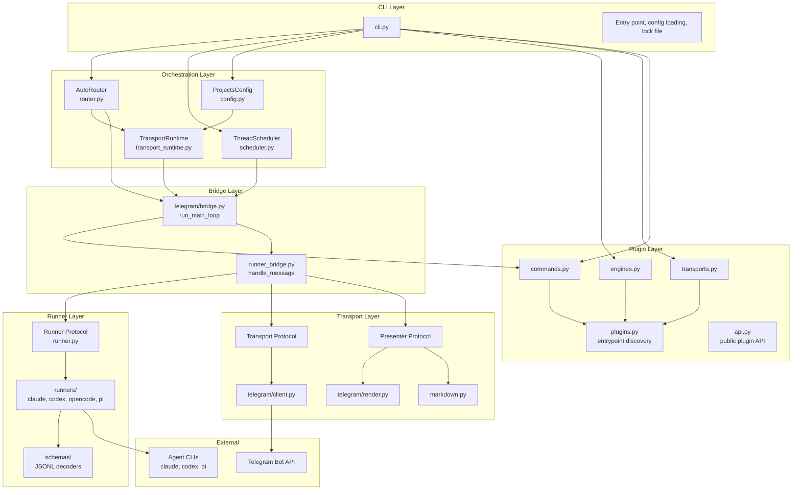
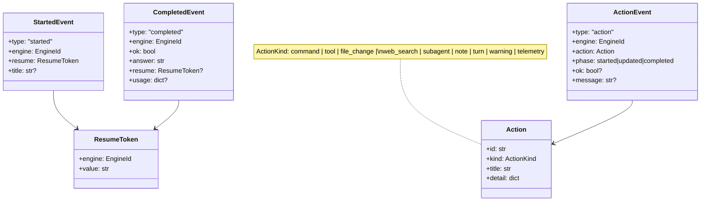
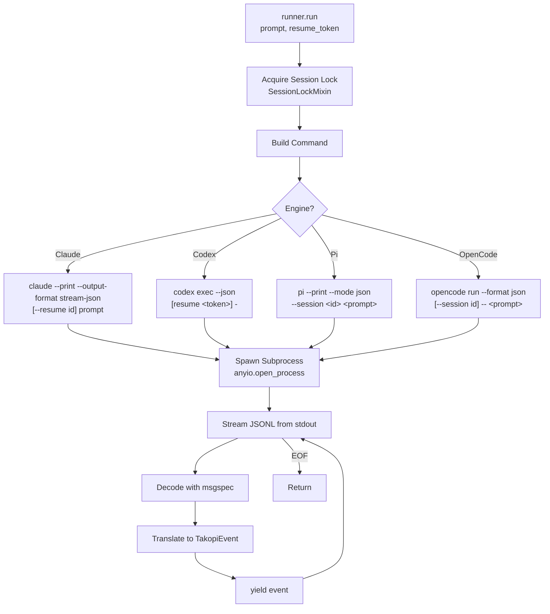
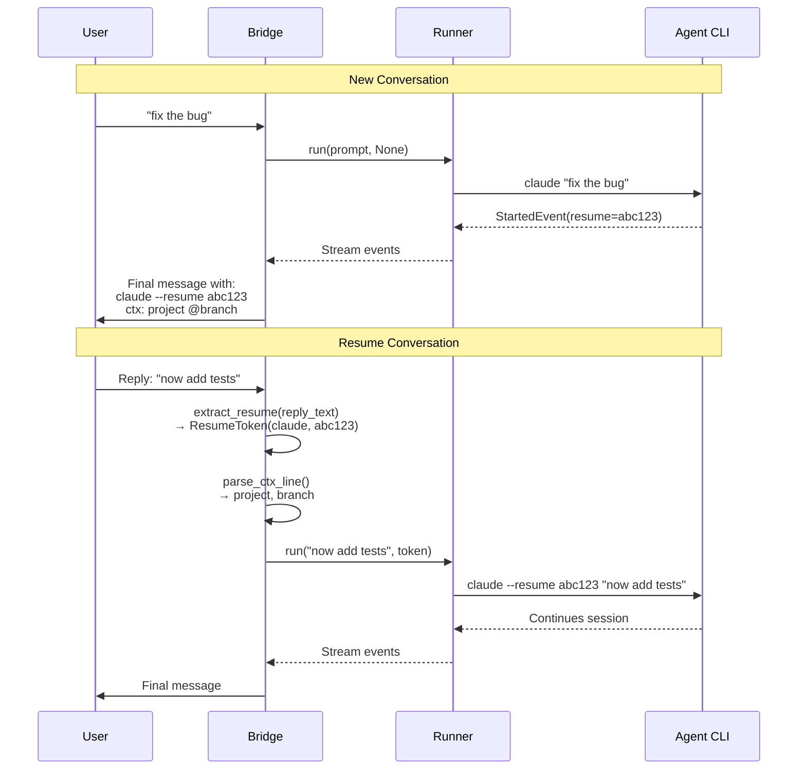
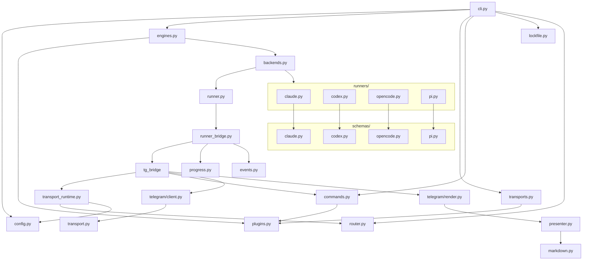
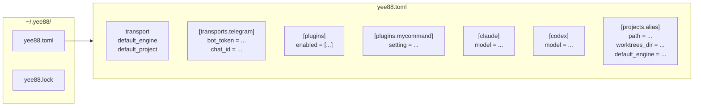
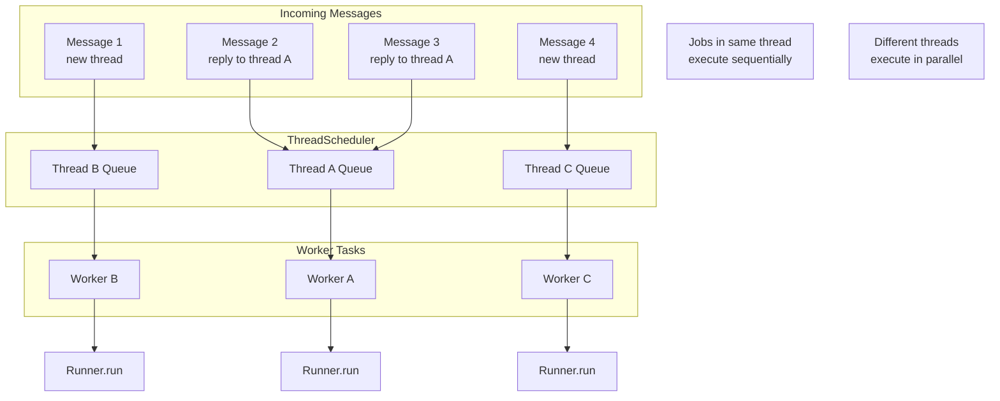

# Takopi Architecture & Lifecycle

## Layer Diagram



---

## Plugin Architecture

Takopi discovers plugins via Python entrypoints and keeps loading lazy:

- **Engine backends** (`yee88.engine_backends`)
- **Transport backends** (`yee88.transport_backends`)
- **Command backends** (`yee88.command_backends`)

Entrypoint names become plugin IDs, are validated up front (reserved names, regex),
and are only loaded when needed. The public surface for plugin authors lives in
`yee88.api`, while transports and commands interact with core routing via
`TransportRuntime`.

---

## Domain Model



---

## Message Lifecycle

```mermaid
sequenceDiagram
    participant User
    participant Telegram
    participant Bridge as telegram/bridge.py
    participant Scheduler as ThreadScheduler
    participant RunnerBridge as runner_bridge.py
    participant Runner
    participant AgentCLI as Agent CLI
    participant Command as Command Plugin

    User->>Telegram: Send message
    Telegram->>Bridge: poll_incoming()

    Bridge->>Bridge: Parse slash command
    alt Command plugin
        Bridge->>Command: handle(ctx)
        Command->>RunnerBridge: run_one/run_many (optional)
        RunnerBridge->>Telegram: Send progress/final
    else Default routing
        Bridge->>Bridge: Parse directives<br/>(/&lt;engine-id&gt;, /&lt;project-alias&gt;, @branch)
        Bridge->>Bridge: Extract resume token<br/>from reply
        Bridge->>Bridge: Resolve worktree<br/>(if @branch)

        Bridge->>Scheduler: enqueue(ThreadJob)
        Scheduler->>RunnerBridge: handle_message()

        RunnerBridge->>Telegram: Send progress message
        RunnerBridge->>Runner: run(prompt, resume)
    end

    Runner->>AgentCLI: Spawn subprocess

    loop JSONL Stream
        AgentCLI-->>Runner: JSONL event
        Runner-->>RunnerBridge: TakopiEvent
        RunnerBridge->>Telegram: Edit progress message
    end

    AgentCLI-->>Runner: Completed
    Runner-->>RunnerBridge: CompletedEvent
    RunnerBridge->>Telegram: Send final answer
    RunnerBridge->>Telegram: Delete progress message
```

---

## Runner Execution Flow



---

## Resume Token Flow



---

## Component Dependencies



---

## Configuration Structure



---

## Thread Scheduling



---

## Summary

| Layer | Components | Responsibility |
|-------|------------|----------------|
| **CLI** | `cli.py` | Entry point, config, lock |
| **Plugins** | `plugins.py`, `engines.py`, `transports.py`, `commands.py`, `api.py` | Entrypoint discovery, plugin loading, public API boundary |
| **Orchestration** | `router.py`, `scheduler.py`, `config.py` | Engine selection, job queuing, project config |
| **Bridge** | `telegram/bridge.py`, `runner_bridge.py` | Message handling, execution coordination |
| **Runner** | `runner.py`, `runners/*.py`, `schemas/*.py` | Agent CLI subprocess, JSONL parsing, event translation |
| **Transport** | `transport.py`, `presenter.py`, `telegram/client.py` | Telegram API, message rendering |
| **Domain** | `model.py`, `progress.py`, `events.py` | Event types, action tracking |
| **Utils** | `worktrees.py`, `utils/*.py`, `markdown.py` | Git worktrees, formatting, paths |
